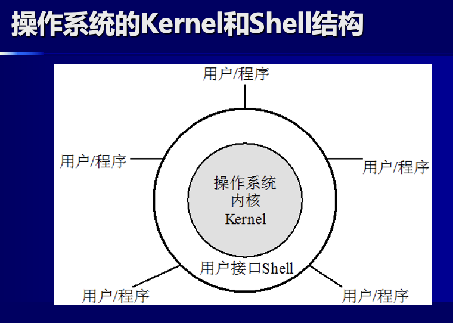
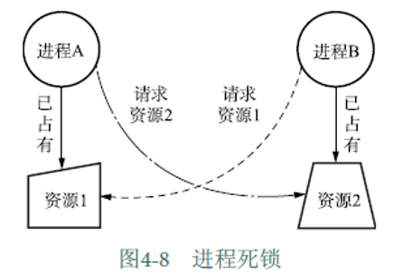

### 3.4 输入输出系统
- 外设：与用户打交道，又称为人机交互设备（HID）。
- 端口：又称接口，是连接输入/输出设备的物理接插件。PC机共有六种

端口和主机的数据传输模式有**串行**和**并行**两种

输入设备：鼠标，键盘

输出设备：主要有显示器和打印机
#### 显示器
- 主要有CRT和LCD两类
- 显示系统：显示器+显示适配器（显卡，控制显示方式）
- VGA，SVGA等是显示标准
- 主要技术指标是分辨率
#### 打印机
- 分辨率为点密度
- 分为激光，喷墨，针式等
#### 其他接口卡
声卡，网卡
#### 系统总线标准
如PCI总线，PCMCIA
USB是一种总线标准，也是一种技术，有Inter公司发起并制定的**通用串行总线**标准，可连接多达127台设备
#### 接口
接口有两个部分，一部分通过内部总线连接CPU和存储器，另一部分则通过外部总线连接外设。

## 操作系统概述
#### 4.2 操作系统的类型
- 实时系统
实时系统要求在规定时间内相应，大多数都是专用系统，如天宫一号
- 单用户单任务
计算机只能由一个人使用且一次只能执行一个任务，如早期的PC机的DOS系统（Disk OS），效率低，对硬件要求低。
- 单用户多任务
Windows，Mac OS，采用任务是一种分时处理技术，实现循环，可以在多个程序之间进行数据交换。要在用户界面处理，系统资源的分配和调度等方面大方面处理，因此整个系统比较庞大且比较复杂。
- 多用户多任务
最早的UNIX，允许多个用户使用一台主机。
- 分布式系统
集群，网络，“云计算”
- 并行系统
针对计算机系统的多处理器要求设计的，除了完成单一处理器同样的作业与进程控制任务外，还需要完成在系统的多个处理器之间的活动分配和调度。
并行系统解决“**负载平衡**”（Load Balancing）问题和“**缩放**”问题
### 4.3 操作系统的结构
操作系统的结构基于软件的层次结构，把操作系统分为**内核**（Kernal）和**外壳**（Shell）两层。

### 4.4 操作系统的功能
#### 1 进程管理
进程（Processes）指正在执行中的程序，进程越多，进程管理就越复杂。进程管理最重要的任务就是**进程调度**，目的是有效管理且防止死锁。
死锁是多个进程同时占用对方需要的资源而同时请求对方的资源，而它们在得到请求之前不会释放所占有的资源。发生死锁会导致系统处于**无效等待状态**，因此必须撤销其中的一个进程。

线程是进程概念的延伸。

- 单一线程
- 线程/轻量级线程
#### 2 存储器管理
存储器管理器（Memory Manage Unit，MMU）

- 内存管理
- 内存和外存数据交换
- 虚拟内存
#### 3 设备管理
如何对设备进行区分并制定不同设备的不同的访问策略，使系统实现有效管理，是操作系统设备管理的主要任务。
- I/O服务
- 设备驱动程序（Driver）
OS不直接操纵设备，它是通过管理设备的驱动程序操作设备的。
### 4.5 文件管理
## 计算机网络
TCP/IP（Transmission Control Protocol / Internet Protocol）

传输控制协议/网络互连协议

- TCP：数据打包、编号，在**接收端**将数据按原格式组合
- IP：为每个**数据包**加上**接收机地址**后在网络信道中传输
- Host 拥有IP地址的机器叫做主机，路由根据IP地址传输数据包

专用地址范围：
10.0.0.0 ~ 10.255.255.255

172.16.0.0 ~ 172.31.255.255

192.168.0.0 ~ 192.168.255.255

# 2025-6-26
